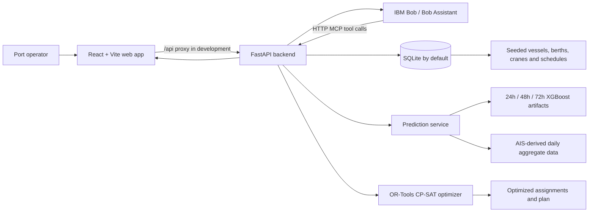

# Architecture

## System Architecture

## Components

| Component | Technology | Responsibility |
|---|---|---|
| Web application | React 19, TypeScript, Vite, Tailwind | Presents dashboard, monitoring, prediction, planner, optimization, simulation, and Bob-assistant workflows. Vite proxies `/api` to FastAPI in local development. |
| API | FastAPI, Pydantic, SQLAlchemy | Initializes state, validates requests, routes operations, and serves OpenAPI at `/docs`. |
| Operational store | SQLite by default; PostgreSQL-compatible SQLAlchemy URL | Stores ports, vessels, schedules, berths, cranes, predictions, optimization runs, plans, and scenarios. |
| Seed data | Python startup seeder | Supplies the runnable LALB scenario and refreshes the future 72-hour vessel schedule when needed. |
| Forecasting | pandas, scikit-learn, XGBoost, joblib | Produces 24h/48h/72h port-level congestion-pressure probabilities from AIS-derived features. |
| Optimization | Google OR-Tools CP-SAT | Produces vessel-to-berth assignments designed to minimize priority-weighted waiting time. |
| MCP wrapper | FastAPI routes and MCP service classes | Lists tool schemas and dispatches the same port intelligence and planning capabilities for IBM Bob. |

## Data Flow

### Forecast flow

1. `src/AI/pipeline.py` engineers calendar, lag, rolling-window, and anchor-queue momentum features from daily LALB AIS aggregates.
2. The pipeline writes three joblib payloads to `src/AI/models/` and feature-importance CSV reports to `src/AI/reports/`.
3. `PredictionService` finds those artifacts, builds the latest compatible feature row, and calls `predict_proba` for each requested horizon.
4. Probabilities are assigned to risk bands: `LOW` (below 0.40), `MODERATE` (0.40–0.59), `HIGH` (0.60–0.79), and `CRITICAL` (0.80+).
5. `GET /api/v1/congestion/forecast/{port_id}` returns the three forecasts and stores them for downstream status and hotspot calls.

### Planning and optimization flow

1. During FastAPI startup, the application creates database tables and seeds `lalb` if absent.
2. A planning or optimization request loads scheduled vessels, berths, and cranes for the requested horizon.
3. The service calculates a baseline schedule, then calls the OR-Tools optimizer.
4. The optimizer result is persisted as an optimization run or operations plan and returned with assignments and waiting-time metrics.
5. The planner and optimization pages display the returned result; they also have UI-level fallback content if an API call fails.

### Bob tool flow

1. A caller discovers tool definitions through `GET /api/v1/mcp/tools`.
2. It calls `POST /api/v1/mcp/tools/{tool_name}` with `{ "arguments": { ... } }`.
3. The MCP service executes the relevant forecast, status, schedule, optimization, scenario, plan, or explanation operation and returns structured JSON.

## API Surface

The FastAPI interactive contract is the source of truth at `http://localhost:8001/docs` when running locally. The principal routes are:

| Area | Endpoints |
|---|---|
| Service | `GET /`, `GET /api/v1/health` |
| Ports | `GET /api/v1/ports`, `GET /api/v1/ports/{port_id}`, `GET /api/v1/ports/{port_id}/status` |
| Congestion | `GET /api/v1/congestion/forecast/{port_id}`, `/current/{port_id}`, `/hotspots/{port_id}`, `/predictions/{port_id}` |
| UI data | `GET /api/v1/dashboard/summary`, `GET /api/v1/monitoring` |
| Optimization | `POST /api/v1/optimization/run`, `/compare`, or `/optimize`; `GET /api/v1/optimization/{run_id}` |
| Planning | `POST /api/v1/plans/72-hours/generate`, `GET /api/v1/plans/{plan_id}`, `POST /api/v1/scenarios/what-if` |
| MCP | `GET /api/v1/mcp/tools`, `POST /api/v1/mcp/tools/{tool_name}`, `GET /api/v1/mcp/resources`, `GET /api/v1/mcp/status` |

## Security and Operational Notes

- Local development uses SQLite and has no authentication or authorization layer. Do not expose this prototype directly to the internet.
- CORS is restricted in code to common localhost origins. A deployment should use an explicit production allowlist, HTTPS, authentication, authorization, rate limits, and audited secrets management.
- The default data path has no required API keys. `DATABASE_URL` may be changed to a PostgreSQL connection string for a persistent deployment.
- Forecast artifacts and the LALB operational scenario are local prototype assets. External feeds, real berth availability, and production schedule writes are not implemented.

## Scalability Path

The API is organized into route and service layers, so it can be scaled independently of the browser client. A production evolution would replace seed data with validated AIS, terminal, weather, and schedule feeds; use PostgreSQL and migrations; run model training separately from inference; cache read-heavy forecasts; and put the API behind authenticated, monitored infrastructure. The optimizer should then be validated against actual port constraints before its results are used operationally.
