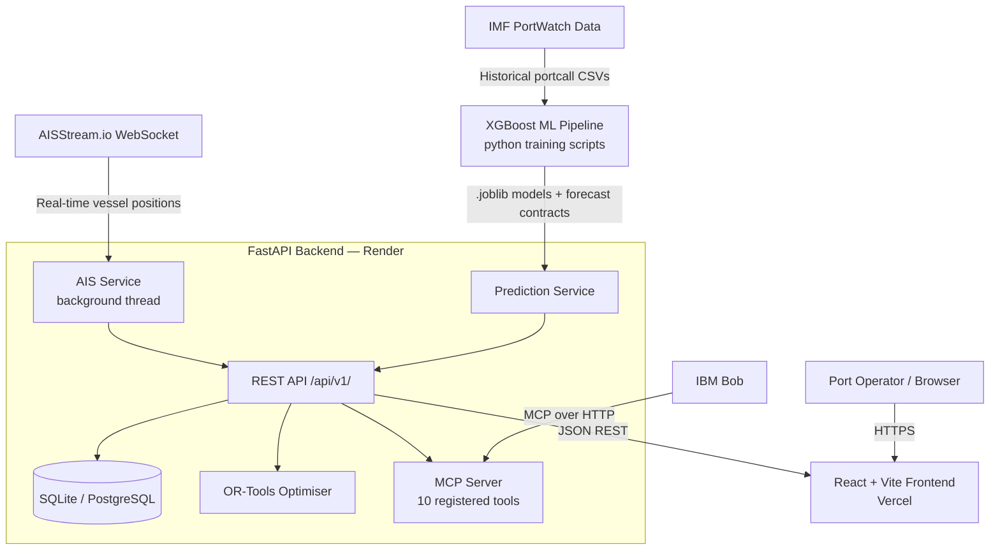

# Architecture

## System Architecture

Harborline is a three-tier web application with a real-time data ingestion layer and an embedded MCP server for IBM Bob integration.

## Components

| Component | Technology | Responsibility |
|---|---|---|
| Frontend | React 18 + Vite + TypeScript | Dashboard UI — KPIs, congestion trends, vessel monitoring, berth status, optimisation, planner, IBM Bob chat |
| Backend API | FastAPI (Python) | Business logic, REST endpoint orchestration, session management |
| AIS Service | Python + websockets | Streams live vessel position data from AISStream.io into an in-memory cache per port bounding box |
| Prediction Service | XGBoost + joblib | Loads pre-trained models and contract files to serve 24h/48h/72h congestion probability forecasts |
| Optimisation Engine | Google OR-Tools CP-SAT | Solves vessel-berth-crane assignment as a constraint satisfaction problem; greedy fallback if OR-Tools unavailable |
| MCP Server | Custom MCP implementation in FastAPI | Exposes 10 structured tools to IBM Bob for port status, forecasts, optimisation, what-if, and 72h plan generation |
| Database | SQLAlchemy + SQLite (dev) / PostgreSQL (prod) | Stores berth definitions, vessel schedules, crane configurations, and generated 72h plans |
| ML Pipeline | XGBoost + scikit-learn + pandas | Offline training on IMF PortWatch Indian port data; outputs .joblib models and indian_ports_forecast.json contract |

## Data Flow

1. **Live AIS:** On backend startup, a background daemon thread connects to AISStream.io WebSocket, subscribes to bounding boxes for all five Indian ports, and maintains an in-memory dict of live vessel positions keyed by MMSI.
2. **Forecast serving:** When a congestion forecast is requested (`GET /api/v1/congestion/forecast/{port_id}`), the Prediction Service reads the pre-computed `indian_ports_forecast.json` contract file, returns 24h/48h/72h risk scores, and enriches with AIS-derived live vessel counts.
3. **Dashboard:** The React frontend polls `GET /api/v1/dashboard/summary?port_id=...` on mount and on manual refresh. The backend assembles KPIs from the Prediction Service (congestion risk) and AIS Service (live vessel counts) and returns a structured response.
4. **Optimisation:** The operator submits a POST to `/api/v1/optimization/compare`; the OR-Tools engine reads vessel ETAs and berth/crane configs from the database, runs the CP-SAT solver, and returns before/after metrics.
5. **IBM Bob:** Bob calls MCP tool endpoints via `POST /api/v1/mcp/tools/{tool_name}`. Tools read from the same Prediction, AIS, and Port services as the REST API and return structured JSON responses that Bob presents to the operator in natural language.

## Security Considerations

- All secret credentials (AISStream API key, database URL, CORS origins) are loaded exclusively from environment variables — never committed to the repository.
- CORS is configured via the `CORS_ORIGINS` environment variable and restricted to the deployed frontend URL in production.
- The AIS API key is never returned in any API response or logged at INFO level.
- The `.env` file is in `.gitignore`; only `.env.example` with placeholder values is committed.
- The health endpoint (`/api/v1/health`) does not expose internal file paths, model weights, or credentials.

## Scalability Notes

The FastAPI backend is fully stateless except for the in-memory AIS vessel cache (which is a local dict per process). In a production deployment beyond the hackathon:

- **Backend scaling:** Multiple Render instances would need the AIS cache replaced with a shared Redis store. The prediction and optimisation services are already stateless.
- **ML pipeline:** The XGBoost models are small (~300KB) and load in milliseconds. For higher-frequency updates, the training pipeline can be run on a daily schedule and push new contract files to blob storage.
- **Database:** Switching `DATABASE_URL` to a managed PostgreSQL instance (Render, Supabase, or IBM Db2) requires zero code changes — SQLAlchemy handles the dialect difference automatically.
- **AIS throughput:** AISStream.io supports high-volume commercial subscriptions. The current single-thread listener handles hackathon traffic; a production deployment would use asyncio with multiple reconnect workers.
